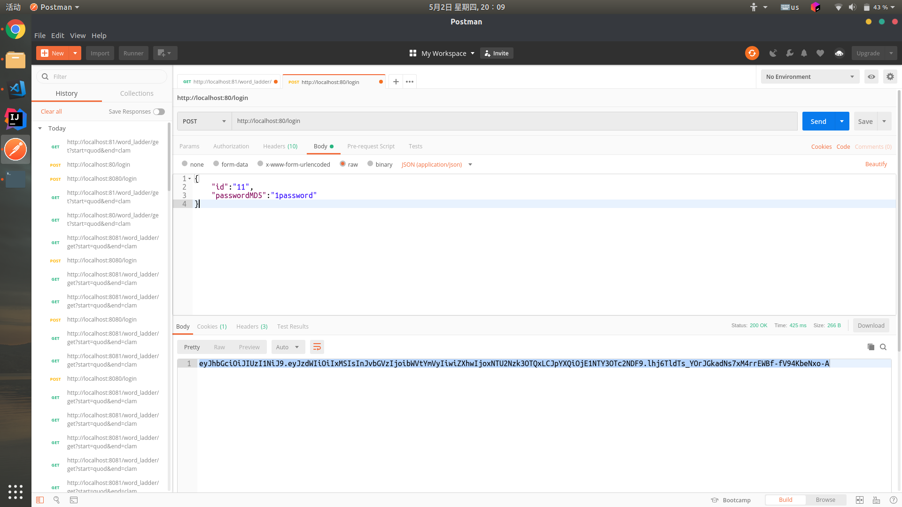

# WordLadder Microservice

## Introduction 

The wordladder application is splited into two microservices, one is login module and another is the functionality module.

The login microservice is stored in `/login`, and the wordladder microservice is stored in `/wordladder`.

The authentication process is as follows:
1. Send a login post to login microservice, if the username and password matches, it will return a JWT token.
2. Include the token in a GET method's header, using the bearer auth and send request to wordladder microservice.
3. If token is valid, you'll get the answer in response.

## How to use

1. Pull the images:

```shell
$ docker pull sebastianj1w/login
$ docker pull sebastianj1w/wordladder-java:microservice
```

2. Run the containers(`${port0}` and `${port1}` is depend on your choice):

```shell
$ docker run -d -p ${port0}:8080 sebastianj1w/login
$ docker run -d -p ${port1}:8081 sebastianj1w/wordladder-java:microservice
```

3. Now the microservices is expected to be running. Try to use them via postman or other tools. Username and password are in pictures below.(To make test easier, I used a plaintext transmission, it's not hard to make it more safe.)




## Dockerhub links

1. sebastianj1w/wordladder-java:https://hub.docker.com/r/sebastianj1w/wordladder-java
2. sebastianj1w/login:https://hub.docker.com/r/sebastianj1w/login
